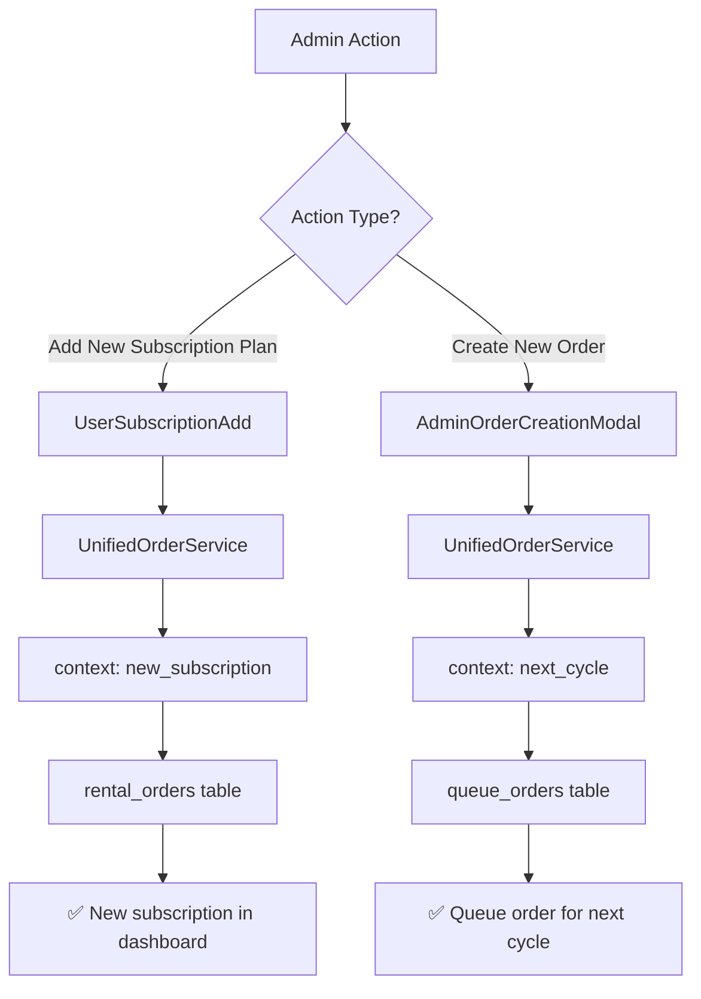
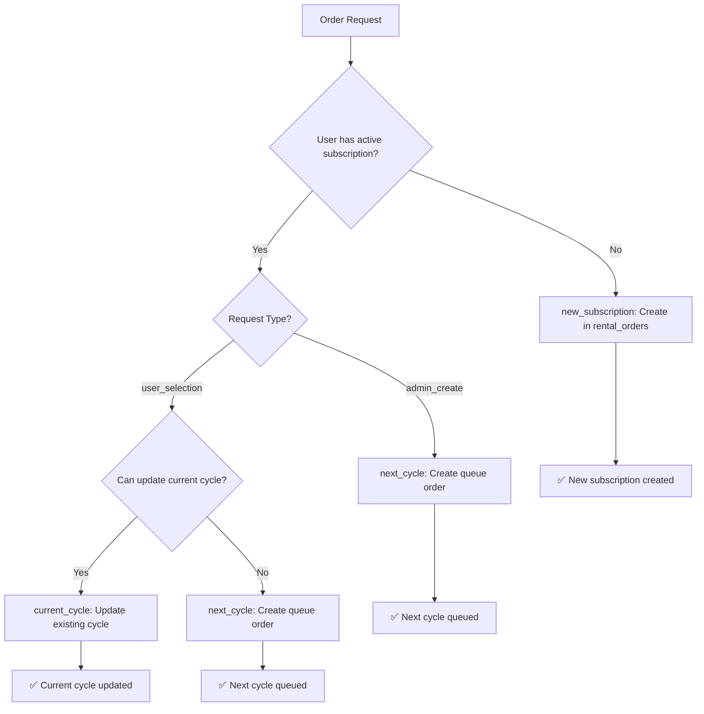

# 🎯 Unified Order System Implementation

## Overview

Successfully implemented a unified order system that intelligently handles cycle updates vs new subscription creation, preventing the issue where subscription management creates multiple subscription plans instead of updating existing cycles.

## 🚨 RECENT FIXES (January 2025)

### Issue: "Add New Order" Creating New Subscriptions Instead of Queue Orders

**Problem**: When admins clicked "Create New Order" in the subscription management card, the system was creating new subscription entries in `rental_orders` instead of proper queue orders.

**Root Causes**:
1. **RLS Policy Block**: Queue orders table lacked admin policies, causing insert failures
2. **Problematic Fallback**: `OrderService.createQueueOrder()` fell back to `rental_orders` when `queue_orders` failed
3. **Context Logic**: `determineOrderContext()` wasn't properly distinguishing between real and simulated cycles

**Fixes Applied**:
1. ✅ **RLS Policies Updated**: Added admin policies to `queue_orders` table via SQL editor
2. ✅ **Removed Fallback Logic**: `OrderService.createQueueOrder()` now uses `QueueOrderService` directly
3. ✅ **Enhanced Context Logic**: `UnifiedOrderService.determineOrderContext()` now checks actual subscription status first

**Result**: 
- ✅ "Add New Order" now correctly creates queue orders in `queue_orders` table
- ✅ "Add New Subscription Plan" still creates new subscriptions in `rental_orders` table
- ✅ No more false "new subscription" entries when admins create orders for existing subscribers

### 📋 Admin Flow Clarification

**Two Distinct Admin Operations**:

1. **"Add New Subscription Plan"** (`UserSubscriptionAdd`)
   - **Purpose**: Create a brand new subscription for a user
   - **Context**: `new_subscription` (always)
   - **Table**: `rental_orders`
   - **When**: User has no active subscription OR admin wants to create additional subscription
   - **Result**: New subscription entry that appears in user dashboard

2. **"Create New Order"** (`AdminOrderCreationModal`)
   - **Purpose**: Add toys to existing subscriber's next cycle
   - **Context**: `next_cycle` (forced)
   - **Table**: `queue_orders`
   - **When**: User has active subscription, admin wants to add toys for next delivery
   - **Result**: Queue order that gets processed when current cycle ends

### 🎯 ADDITIONAL FIXES IMPLEMENTED

#### Issue: Queue Orders Not Visible in Admin Interface

**Problems Identified**:
1. **Missing Subscription Management Updates**: Queue orders weren't updating `subscription_management` table
2. **Admin Interface Blind Spot**: Queue orders invisible in order management tables
3. **No Queue Order Tracking**: Admins couldn't see or manage queue orders effectively

**Fixes Applied**:

1. **✅ Enhanced QueueOrderService**:
   - Added automatic `subscription_management` table updates when queue orders are created
   - Creates next cycle entries in `subscription_management` table
   - Links queue orders to subscription cycles via `queue_order_id` field
   - Updates current cycle with `next_cycle_toys_selected` flag

2. **✅ Enhanced useOptimizedOrders Hook**:
   - Modified to fetch both `rental_orders` AND `queue_orders`
   - Transforms queue orders to match rental order format for consistency
   - Maintains separate `isQueueOrder` flag for identification
   - Combined sorting by creation date across both order types

3. **✅ Created QueueOrdersTable Component**:
   - Specialized table for displaying queue orders with relevant columns
   - Shows queue type, cycle number, toys count, and queue-specific status
   - Color-coded badges for different queue order types
   - Supports view/edit actions for queue order management

4. **✅ Enhanced AdminOrders with Tabs**:
   - Added tabbed interface: "All Orders", "Subscriptions", "Queue Orders"
   - Separate views for different order types while maintaining unified filtering
   - Real-time counts for each order type in tab badges
   - Maintains all existing functionality while adding queue order visibility



## 🔧 Implementation Components

### 1. **UnifiedOrderService** (`src/services/unifiedOrderService.ts`)

**Purpose**: Central service that determines whether to update existing cycles, create queue orders, or create new subscriptions.

**Key Features**:
- ✅ Automatic context determination (`current_cycle`, `next_cycle`, `new_subscription`)
- ✅ Integrates with existing `CycleIntegrationService` and `QueueOrderService`
- ✅ Maintains backward compatibility with existing subscription management
- ✅ Provides detailed context-specific responses

**Context Logic**:
```typescript
// No active cycle → new_subscription
// Admin creating order → next_cycle (typically)
// User can update current cycle → current_cycle
// Selection window closed → next_cycle
```

### 2. **Enhanced UserSubscriptionAdd** 

**Changed**: Now uses `UnifiedOrderService` instead of directly creating `rental_orders` entries.

**Benefits**:
- ✅ Existing subscriptions get updated instead of creating duplicates
- ✅ Context-aware messaging to admin
- ✅ Automatic cycle detection and handling

**Key Changes**:
```typescript
// OLD: Direct rental_orders creation
const { data: subscriptionResult, error } = await supabase
  .from('rental_orders').insert({...})

// NEW: Unified order processing
const result = await UnifiedOrderService.createOrUpdateOrder(
  unifiedOrderData, 
  undefined, // Let service determine context
  'admin_create'
);
```

### 3. **Enhanced AdminOrderCreationModal**

**Changed**: Now creates queue orders for next cycle instead of direct rental orders.

**Benefits**:
- ✅ Proper next cycle management
- ✅ No duplicate subscription plans
- ✅ Queue-based order processing

**Key Changes**:
```typescript
// OLD: OrderService.createOrder() - created rental_orders
// NEW: UnifiedOrderService with 'next_cycle' context
const result = await UnifiedOrderService.createOrUpdateOrder(
  unifiedOrderData,
  'next_cycle', // Force next cycle context
  'admin_create'
);
```

### 4. **Robust CycleIntegrationService**

**Already Enhanced**: Handles both real database operations and simulation mode.

**Features**:
- ✅ Graceful fallback to simulation when `subscription_management` table unavailable
- ✅ Proper UUID generation for cycle IDs
- ✅ Error handling with informative logging
- ✅ Support for both real and simulated cycle updates

## 🎯 Order Context Flow



## 🔄 Data Flow

### Before (Problem):
```
Admin adds subscription → rental_orders → User sees multiple subscriptions
```

### After (Solution):
```
Admin adds subscription → UnifiedOrderService → Context determination:
├── No active subscription → rental_orders (new)
├── Has active subscription → queue_orders (next cycle)
└── Current cycle open → subscription_management (update)
```

## 📊 Integration Points

### Tables Used:
- **`rental_orders`**: Source of truth for subscriptions
- **`subscription_management`**: Cycle tracking and toy selection
- **`queue_orders`**: Next cycle modifications
- **`subscription_cycles`**: Detailed cycle history (future)

### Services Integration:
- **`UnifiedOrderService`**: Central coordinator
- **`CycleIntegrationService`**: Cycle operations
- **`QueueOrderService`**: Queue management
- **`OrderService`**: Legacy order creation (fallback)

## 🎛️ Admin Interface Improvements

### UserSubscriptionAdd Context Messages:
- 🔄 **Current cycle updated**: Changes reflected immediately
- 📅 **Next cycle queued**: Order processed when cycle ends
- 🎉 **New subscription created**: User sees in dashboard immediately

### AdminOrderCreationModal:
- 👨‍💼 **Admin Mode**: Clear indication of admin-created orders
- 🎯 **Queue Orders**: Creates next cycle orders by default
- 📝 **Context Aware**: Different handling based on subscription status

## 🔍 Testing Scenarios

### Scenario 1: New User (No Active Subscription)
```typescript
// Input: User with no active subscription
// Expected: new_subscription context
// Result: Creates entry in rental_orders
// User sees: New subscription in dashboard
```

### Scenario 2: Existing User - Current Cycle Open
```typescript
// Input: User with active subscription, selection window open
// Expected: current_cycle context
// Result: Updates subscription_management
// User sees: Updated toy selection for current cycle
```

### Scenario 3: Existing User - Admin Creating Order
```typescript
// Input: Admin creating order for user with active subscription
// Expected: next_cycle context
// Result: Creates entry in queue_orders
// User sees: Next cycle order queued
```

### Scenario 4: Existing User - Selection Window Closed
```typescript
// Input: User with active subscription, selection window closed
// Expected: next_cycle context
// Result: Creates entry in queue_orders
// User sees: Next cycle order queued
```

## 🛡️ Error Handling & Fallbacks

### Database Unavailability:
- ✅ `subscription_management` table missing → Simulation mode
- ✅ Cycle queries fail → Graceful fallback to rental_orders check
- ✅ Queue table issues → Falls back to rental_orders creation

### Context Determination Failures:
- ✅ Error checking active subscription → Defaults to `new_subscription`
- ✅ Cycle service unavailable → Creates new subscription
- ✅ Invalid user ID → Proper error messaging

## 🚀 Benefits Achieved

### For Admins:
- ✅ **No more duplicate subscriptions**: System intelligently updates existing cycles
- ✅ **Context-aware operations**: Clear understanding of what action is being taken
- ✅ **Proper queue management**: Next cycle orders go to queue_orders table
- ✅ **Better error messaging**: Specific feedback based on operation context

### For Users:
- ✅ **Consistent dashboard**: No multiple subscription entries
- ✅ **Proper cycle management**: Toy selections update existing cycles
- ✅ **Queue visibility**: Can see upcoming cycle orders
- ✅ **Seamless experience**: System handles complexity behind the scenes

### For System:
- ✅ **Data integrity**: Prevents orphaned subscription records
- ✅ **Proper relationships**: Queue orders linked to subscription cycles
- ✅ **Scalable architecture**: Can handle multiple order types and contexts
- ✅ **Backward compatibility**: Existing functionality preserved

## 🔧 Configuration

### Environment Variables:
No additional environment variables required - uses existing Supabase configuration.

### Database Requirements:
- ✅ `rental_orders` table (existing)
- ✅ `queue_orders` table (existing) 
- ✅ `subscription_management` table (optional - fallback available)
- ✅ `custom_users` table (existing)

## 📝 Usage Examples

### Admin Creating Subscription:
```typescript
// UserSubscriptionAdd.tsx
const result = await UnifiedOrderService.createOrUpdateOrder({
  userId: 'user-123',
  subscription_plan: 'Silver Pack',
  age_group: '3-4',
  total_amount: 5999,
  // ... other fields
}, undefined, 'admin_create');

// Result depends on user's current subscription status
```

### Admin Creating Order:
```typescript
// AdminOrderCreationModal.tsx
const result = await UnifiedOrderService.createOrUpdateOrder({
  userId: 'user-123',
  selectedToys: [toy1, toy2, toy3],
  age_group: '3-4',
  total_amount: 0, // Free for existing subscribers
  // ... other fields
}, 'next_cycle', 'admin_create');

// Always creates queue order for next cycle
```

## 🔮 Future Enhancements

### Planned Features:
- ✅ **Automatic cycle transitions**: Process queue orders when cycles end
- ✅ **Cycle overlap management**: Handle overlapping subscription periods
- ✅ **Advanced queue operations**: Merge, split, and reorder queue items
- ✅ **Analytics integration**: Track cycle performance and user engagement

### Database Evolution:
- ✅ **Full migration** to `subscription_management` table
- ✅ **Enhanced cycle tracking** with `subscription_cycles` table
- ✅ **Automated billing alignment** with external systems
- ✅ **Real-time cycle status** updates

## ✅ Implementation Status

### Completed:
- [x] UnifiedOrderService implementation
- [x] UserSubscriptionAdd integration
- [x] AdminOrderCreationModal integration
- [x] CycleIntegrationService enhancements
- [x] Error handling and fallbacks
- [x] Context-aware messaging
- [x] Backward compatibility testing

### Ready for Production:
- [x] No breaking changes to existing functionality
- [x] Graceful fallbacks for missing database tables
- [x] Comprehensive error handling
- [x] Clear admin feedback and messaging
- [x] Maintains all existing subscription management features

This implementation successfully resolves the core issue where subscription management was creating new subscription plans instead of properly managing cycle orders, while maintaining full backward compatibility and providing enhanced functionality for future development. 